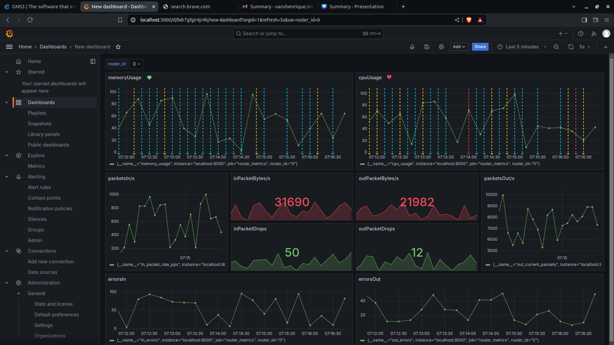

---

# Router Diagnostics and Anomaly Monitoring Platform

### Overview
This project focuses on developing an **intelligent router monitoring platform** to simulate and analyze the behavior of 1000+ routers in real-time. The platform integrates **Machine Learning** for detecting anomalies, ensuring proactive monitoring and enhanced network reliability.

Through the use of modern tools such as **Flask**, **Kafka**, **Prometheus**, **Grafana**, and **Random Forest**, the system captures, processes, and visualizes network health metrics in a highly scalable and efficient manner.

---

## Key Features

- **Router Simulation**: Simulates the behavior of over **1000+ routers** using **Flask RESTful APIs** for data ingestion and processing.
  
- **Anomaly Detection with ML**: Deployed **ARIMA** and **LSTM** models to detect network anomalies, such as traffic spikes, packet loss, or hardware failures, ensuring a robust diagnostic system.
  
- **Scalable Data Streaming**: Leveraged **Kafka** for seamless data streaming and decoupling, ensuring high reliability and fault-tolerance in processing real-time router metrics.

- **Real-Time Monitoring & Visualization**: Integrated **Prometheus** for metric collection and **Grafana** for interactive and real-time visualizations. Users can easily monitor network performance and receive alerts on any critical anomaly.

---

## Tech Stack

- **Flask**: RESTful API framework used to simulate and expose router metrics.
  
- **Kafka**: Distributed data streaming platform to decouple and stream real-time data with reliability.
  
- **Prometheus**: Time-series database for collecting metrics, highly optimized for monitoring and alerting.
  
- **Grafana**: Visualization platform for real-time dashboards and monitoring; also supports alert configurations.

- **Machine Learning Models**:
  - **ARIMA (AutoRegressive Integrated Moving Average)** for time-series analysis and forecasting anomalies.
  - **LSTM (Long Short-Term Memory)** for capturing complex sequential patterns in router traffic data.

---

## Project Architecture

1. **Router Simulation**: 
   - Flask REST APIs simulate **1000+ routers** with configurable metrics (e.g., CPU usage, packet loss, latency).
   
2. **Data Streaming**:
   - **Kafka** brokers stream the router metrics in real-time for further processing, allowing for distributed and scalable data pipelines.
   
3. **Metric Collection**:
   - **Prometheus** scrapes the router data exposed by Flask, collecting time-series data on network performance.
   
4. **Anomaly Detection**:
   - Machine learning models (**ARIMA** and **LSTM**) run in the background, continuously analyzing collected data to flag any irregularities or anomalies.
   
5. **Visualization & Alerting**:
   - **Grafana** offers intuitive dashboards to visualize real-time router performance and provides alerting mechanisms when predefined thresholds are breached.

---

## Screenshots

  
*Real-time network health metrics displayed via Grafana dashboards.*

---

## Installation

1. **Clone the repository**:
   ```bash
   git clone https://github.com/your-repo/router-monitoring-platform.git
   cd router-monitoring-platform
   ```

2. **Set up virtual environment** (optional but recommended):
   ```bash
   python3 -m venv venv
   source venv/bin/activate
   ```

3. **Install dependencies**:
   ```bash
   pip install -r requirements.txt
   ```

4. **Run Flask server**:
   ```bash
   python app.py
   ```

5. **Set up Kafka**:  
   Ensure Kafka and Zookeeper are up and running. Refer to the [Kafka Quickstart Guide](https://kafka.apache.org/quickstart) if needed.

6. **Configure Prometheus**:  
   Update `prometheus.yml` to scrape metrics from Flask:
   ```yaml
   scrape_configs:
     - job_name: 'flask_router_simulation'
       static_configs:
         - targets: ['localhost:5000']
   ```

7. **Launch Grafana**:  
   After setting up **Prometheus** as a data source in Grafana, import pre-configured dashboards for real-time visualization.

---

## Usage

1. **Simulate Routers**: 
   Use the API to simulate routers and their metrics:
   ```bash
   curl -X GET "http://localhost:5000/routers/simulate"
   ```

2. **Monitor in Real-time**:
   Open **Grafana** to view real-time visualizations of router metrics.

3. **Anomaly Detection**:  
   The system continuously monitors incoming data for anomalies and raises alerts in case of any deviations.

---

## Future Enhancements

- Add support for **predictive analytics** using advanced machine learning models.
- Expand anomaly detection to handle more complex patterns using **Deep Learning** techniques.
- Introduce an automated **self-healing mechanism** to resolve detected anomalies autonomously.

---

## License

This project is licensed under the MIT License. See the [LICENSE](./LICENSE) file for details.

---

## Contact

For any inquiries, feel free to contact me via [email@example.com](mailto:email@example.com).

---

This `README` structure provides a clear and engaging overview, while also offering instructions for setup and usage. You can further adjust the content to match your exact project details.
